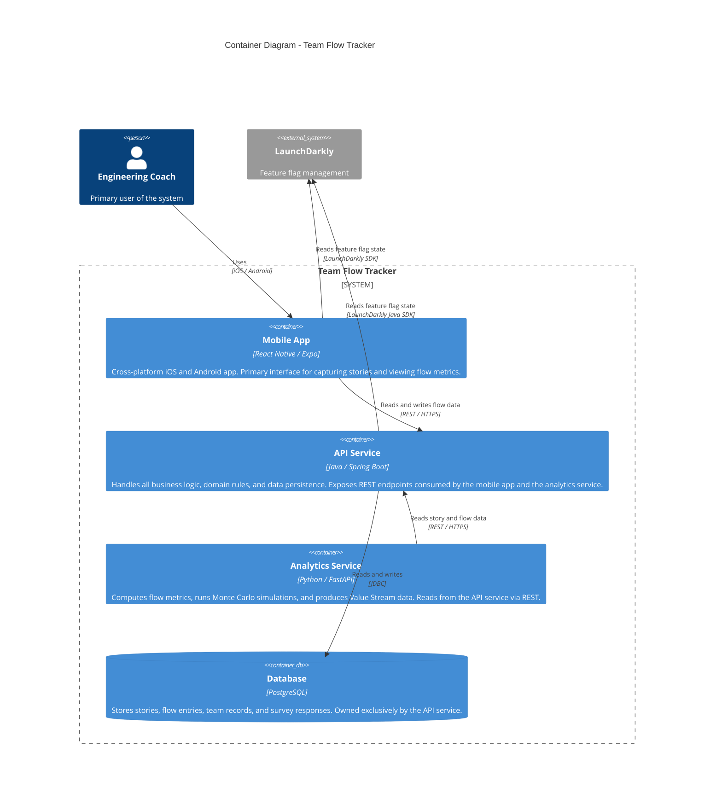

# C4 Level 2: Container Diagram

This diagram opens the Team Flow Tracker system and shows the
deployable services, their technologies, and how they communicate.
No internal component detail is shown at this level.

## Diagram

## Key decisions reflected here

- The API service is the only service that talks to the database.
  The analytics service reads data through the API, not directly
  from PostgreSQL. This keeps the database schema a private
  implementation detail of the API service.

- Both the mobile app and the API service integrate LaunchDarkly
  independently. The mobile app uses the React Native SDK to
  control UI-level feature rollout. The API uses the Java SDK
  to control server-side behaviour. This mirrors the pattern
  used in production mobile coaching engagements.

- All service-to-service communication is synchronous REST at
  this stage. See ADR-002 for the rationale.

## Next level

See [component.md](component.md) for the C4 Level 3 view showing
the internal structure of each service.
