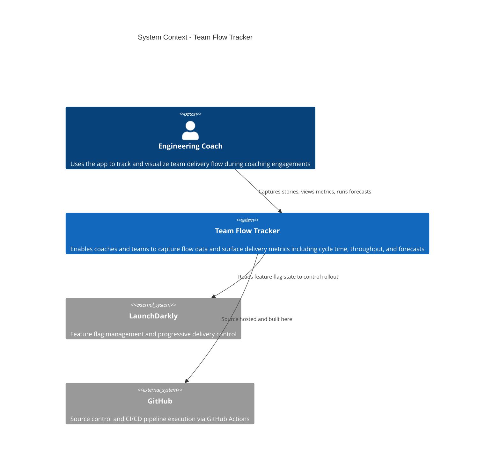

# C4 Level 1: System Context

This diagram shows Team Flow Tracker as a black box, its primary user,
and the external systems it depends on. No technology or implementation
detail is shown at this level.

## Diagram

## Key decisions reflected here

- The primary user is an engineering coach, not an end-user consumer.
  This shapes the UX -- the app assumes technical literacy.
- LaunchDarkly is an external dependency, not something we build.
  This is an explicit architectural choice documented in ADR-001.
- GitHub is both infrastructure and documentation host. The CI/CD
  pipeline and the architecture diagrams live in the same place as
  the code.

## Next level

See [container.md](container.md) for the C4 Level 2 view showing
the deployable services inside Team Flow Tracker.
